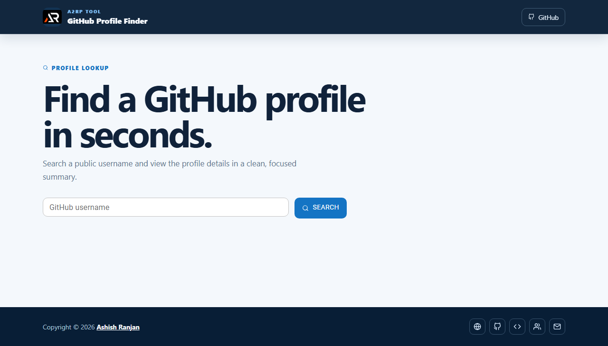

# GitHub Profile Finder

A responsive React app that searches public GitHub usernames and presents profile details, repository counts, follower stats, and profile links in one focused view.



## Features

- GitHub username search using the public GitHub API
- Profile avatar, bio, location, blog, dates, and account statistics
- Loading and not-found feedback with toast messages
- Responsive fixed header, icon-only footer, and go-to-top control
- GitHub Pages deployment setup

## Tech stack

React, Create React App, Axios, Material UI, Sass, React Toastify, and React Icons.

## Run locally

```bash
npm install
npm start
```

## Build and deploy

```bash
npm run build
npm run deploy
```

Live app: [https://a2rp.github.io/fetch-github-profile/](https://a2rp.github.io/fetch-github-profile/)

## Links

- Portfolio: [https://www.ashishranjan.net/](https://www.ashishranjan.net/)
- GitHub: [https://github.com/a2rp](https://github.com/a2rp)
- CodePen: [https://codepen.io/ash1198](https://codepen.io/ash1198)
- LinkedIn: [https://www.linkedin.com/in/aashishranjan](https://www.linkedin.com/in/aashishranjan)
- Facebook: [https://www.facebook.com/theash.ashish/](https://www.facebook.com/theash.ashish/)
- YouTube: [https://www.youtube.com/@ashishranjan-ashz?sub_confirmation=1](https://www.youtube.com/@ashishranjan-ashz?sub_confirmation=1)
- Email: [ash.ranjan09@gmail.com](mailto:ash.ranjan09@gmail.com)

## Support

- Support: [https://a2rp-donation-page.netlify.app/](https://a2rp-donation-page.netlify.app/)
- Buy Me a Coffee: [https://buymeacoffee.com/a2rp](https://buymeacoffee.com/a2rp)
- Patreon: [https://www.patreon.com/a2rp](https://www.patreon.com/a2rp)
